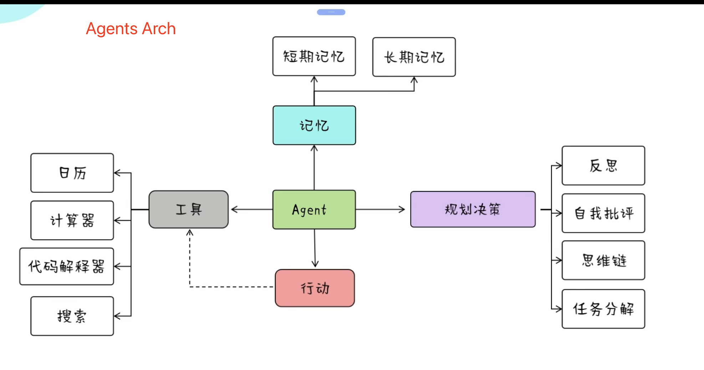

# Awesome Local AI-Agents World

This project demonstrates how to build AI agents using Langchain and Ollama.

## AI-Agents Arch

<center></center>

## Prerequisites

1. Install [Ollama](https://ollama.com/).

2. Download the base model for Ollama.
   ```sh
   ollama pull llama3.1
   # or other models
   ollama pull nezahatkorkmaz/deepseek-v3
   ```

## Setup

0. Clone the repository from github
    ```sh
    git clone https://github.com/ai-chen2050/agents-world.git
    git submodule update --init --recursive
    ```
1. Create a new conda environment:
    ```sh
    conda create -n agents python=3.12
    conda activate agents
    ```

2. Install Langchain:
    ```sh
    pip install langchain
    # or conda
    conda install langchain -c conda-forge
    ```

## Verification

To verify the setup, execute the following script:
```sh
python scripts/ollama-chain.py
```

This will run a sample agent built with Langchain and Ollama.

## Langchain

- More Langchain info, please refer to [Langchain Cookbook](./crates/langchain/cookbook/README.md)